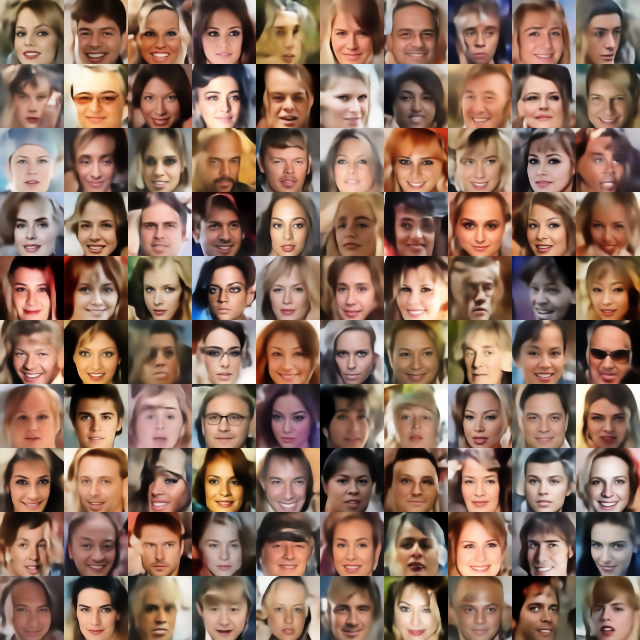
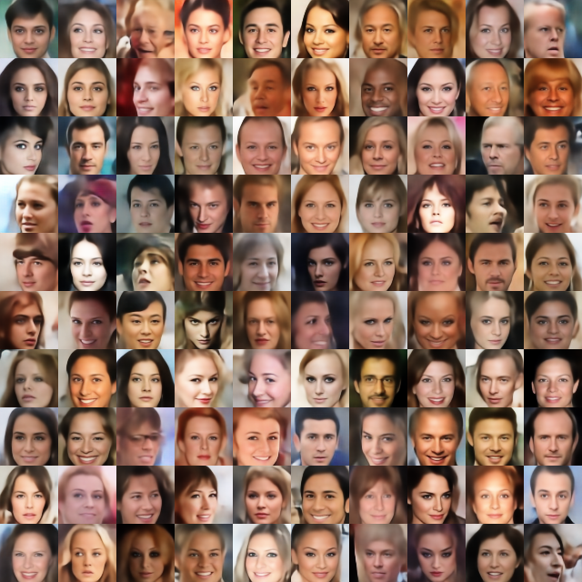
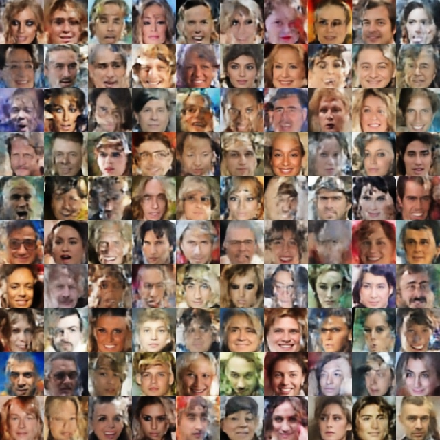
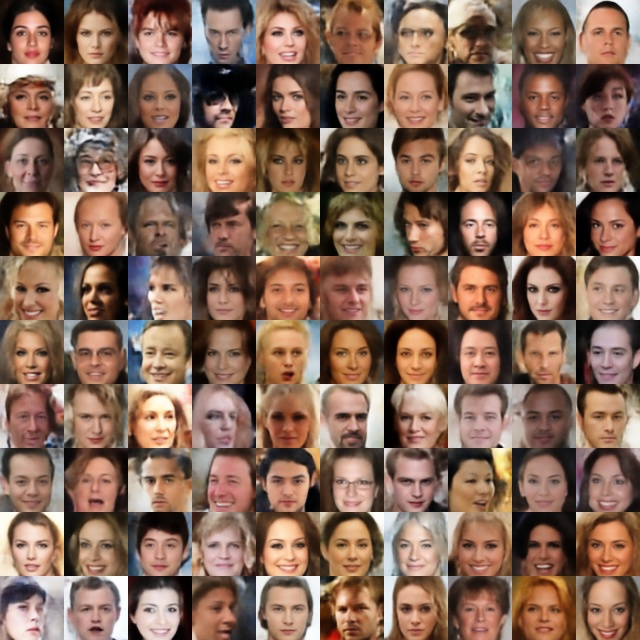

# TwoStageVAE

This is the code for the two-stage VAE model proposed in our ICLR 2019 paper ["Diagnoising and Enhancing VAE Models"](https://openreview.net/forum?id=B1e0X3C9tQ) [1]. 

```
[1] Dai, B. and Wipf, D. Diagnosing and enhancing VAE models. In International Conference on Learning Representations, 2019.
```

## Step 1. Prepare Dataset

We do experiments on MNIST, Fashion-MNIST, Cifar-10 and CelebA dataset. These data are downloaded from the official website and then transformed to npy format using preprocess.py script. Follow the next steps to prepare each dataset. Or you can directly download the data from [Google Doc](https://drive.google.com/open?id=1y_m_UoKfjSJQ6d4EVYL3CrBLSa_t3ftv). (If you directly download the data from Google Doc, extract the file to the root folder.)

### MNIST

Download the data from: http://yann.lecun.com/exdb/mnist/

You will get the files `t10k-images-idx3-ubyte`, `t10k-labels-idx1-ubyte`, `train-images-idx3-ubyte`, `train-labels-idx1-ubyte`. Put them in the folder `./data/mnist`.

### Fashion-MNIST

Download the data from: https://github.com/zalandoresearch/fashion-mnist

Again you will get four files `t10k-images-idx3-ubyte`, `t10k-labels-idx1-ubyte`, `train-images-idx3-ubyte`, `train-labels-idx1-ubyte`. Put them in the folder `./data/fashion`.

To preprocess MNIST and Fashion-MNIST, you also need to install the package `python-mnist` by 
```
pip install python-mnist
```

### Cifar-10

Download the data (python version) from: https://www.cs.toronto.edu/~kriz/cifar.html

Extract the downloaded file in `./data/cifar10`. There will be one sub-folder called `cifar-10-batches-py`. Inside this folder, there will be 6 files named `data_batch_1, data_batch_2, data_batch_3, data_batch_4, data_batch_5` and `test_batch`.

### CelebA Dataset

Download the data from: http://mmlab.ie.cuhk.edu.hk/projects/CelebA.html

Put the extracted images files (202599 jpg files) in the folder `./data/celeba/img_align_celeba`. 

### Preprocess

Transform the data into `.npy` format by running the command 
```
python preprocess.py
```

You will obtain some `.npy` files in each subfolder under `./data`.

## Step 2. Run Two-Stage VAE
Train the model by running
```
python demo.py --dataset [DATASET] --network-structure [NETWORK] --exp-name [EXP] --gpu [GPU]
```
The argument `--exp-name` allows you to set up your experiemnt ID. It will make a folder `./experiments/[DATASET]/[EXP]` to put all the output files and images. If you only want to test the model, add `--val` in the command line.

* Datasets: Use lowercases. You can select from: `mnist, fashion, cifar10` and `celeba`.
* Network structure: You can select from `Infogan, Wae` and `Resnet`. To implement your own network structures, you can add a new derived class of `TwoStageVaeModel` in `./network/two_stage_vae_model.py` and just implement the `build_encoder1` and `build_decoder1` functions. 

## Generated samples
To reproduce the following results with Resnet architecture, run
```
python demo.py --dataset celeba --epochs 100 --lr-epochs 40 --epochs2 100 --lr-epochs2 40 --network-structure Resnet --num-scale 4 --base-dim 32 --latent-dim 128 --gpu [GPU] --exp-name [EXP]
```

* Random samples generated by the **first** stage VAE using Resnet structure on CelebA:



* Random samples generated by the **second** stage VAE using Resnet structure on CelebA:



To reproduce the following results with WAE architecture, run
```
python dome.py --dataset celeba --epochs 70 --lr-epochs 30 --epochs2 70 --lr-epochs2 30 --network-structure Wae --gpu [GPU] --exp-name [EXP]
```
* Random samples generated by the **first** stage VAE using WAE network structure on CelebA:



* Random samples generated by the **second** stage VAE using WAE network structure on CelebA:




